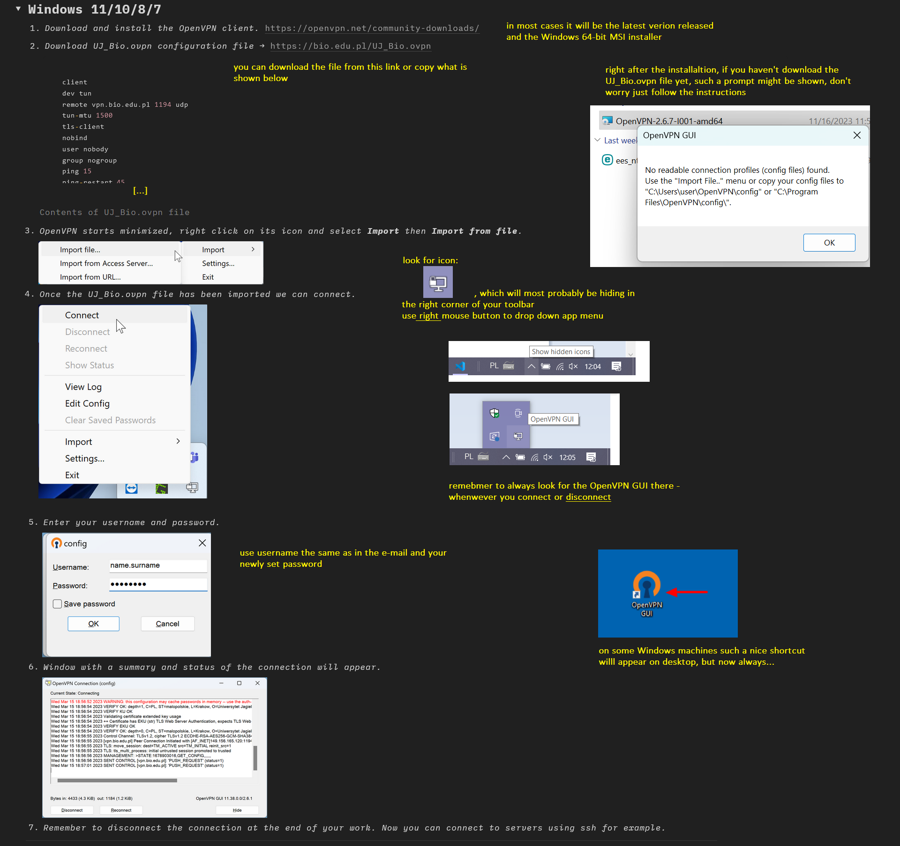
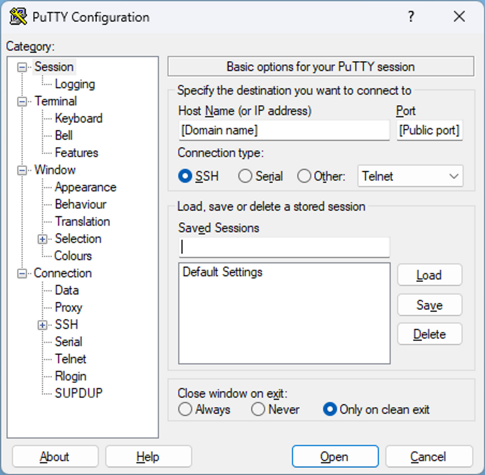

# Computer cluster info

Welcome! This repository contains information about computing and
storage resources available in the Institute of Environmental Sciences,
Faculty of Biology, Jagiellonian University. Please read it carefully
since it contains instructions how to get an access, reach and use the
available infrastructure.

# **Getting access**

To get an access to a given server you need to ask your PI who will contact 
cluster administrator
[helpdesk\@bio.edu.pl](mailto:helpdesk@bio.edu.pl) and ask for creating a user account for you.
Once the account is created you will get an e-mail with login and password. Connection to the
servers is only possible via VPN (Virtual Private Network). Below you
will find information how to establish such connection. 

# Setting your password for the first time

Once you receive an email with your username (usually name.surname) and One Time Password, go to  <https://orkan.bio.edu.pl/ipa/ui/>, login with your username and One Time Password. You'll be asked to set a new password - this password would work on all the servers you have an access to. There's a tutorial -\>  [How to change password using web
browser?](https://uj-campus.notion.site/5c6c78b2bd084e8abeb8664c6fcd99b4?v=4d96fc418e9e41088c2de2e5c74a7e52)

**Important** You have to set your pasword only once and it's the only thing you can do without setting up a VPN connection (see below).

# Connection via VPN

To connect to the servers one needs to start a VPN connection using
OpenVPN.

1.	Start the OpenVPN connection according to the instructions in Tutorial
-\>  [How to connect to the molecol cluster network using
OpenVPN?](https://uj-campus.notion.site/2508eb0f22894133ac4047170750db40?v=b2d9ad84d27d4b4493d58ac03259bf78) and some extra explanations are here:

2.	You can now log in to the servers using their local IP addresses (see below),
remembering to keep the OpenVPN connection running.

# Infrastructure

**Servers**

There are 4 servers available at the moment. You will get an access to
one of them (or more if needed). Table below contains important info
like IP addressees that you will need to connect to them.

| Common name | Hostname         |  IP address    | Port | Access   | HD   | RAM   | CPU | GPU      |
|-------------|----------------- |----------------|------|----------|------|-------|-----|----------|
| GEN         | gen.gorce.local  | 192.168.130.20 | 22   | ssh      | 100 T| 700 G | 170 | 2 Nv L4  |
| SEQ         | seq.gorce.local  | 192.168.130.19 | 22   | ssh      | 50 T | 500 G | 128 | \-       |
| BUG         | bug.gorce.local  | 192.168.130.18 | 22   | ssh      | 68 T | 650 G | 192 | \-       |
| IPS         | ips.gorce.local  | 192.168.130.17 | 22   | ssh      | 96 T | 500 G | 96  | \-       |
| AZOR        | azor.gorce.local | 192.168.130.16 | 22   | ssh      | 20 T | 250 G | 72  | Tesla T4 |

**Important** To be able to connect to the servers, using either Hostname or IP address, you must by connected to VPN first - otherwise you'll get the message `host does not exist`.

**Storage**

Servers are supposed to be our computing resources, NOT a long term
storage. To store the data that you are not currently using all servers
have access to the shared disk storage.

-   matrix (short term storage) has fast connection to machines -  `/mnt/unitymatrix` - this has 80TB.

-   storage (long term storage) has slower connection to machines but provides more space - `/mnt/storage` - this has 360 TB.

-   qnap (long term storage) has slower connection to machines but provides more space -  `/mnt/qnap` - this has 110TB and is used mostly for backups; don't use it as a primary storage.

If you are not using some of your files please transfer them there. Please, remember about compressing your files
while storing. Example commands for compression of all files in a
directory **`tar -cvzf name_of_output_file.tar.gz directory_name`** and
for decompression **`tar -xzvf file_to_decompress.tar.gz`**

# **How to connect to server & log in**

**Work in a command line mode**

*Windows*

You can connect to servers using [PuTTy](https://www.putty.org/) or (recommended) [MobaXterm](https://mobaxterm.mobatek.net/). Below is the instruction for PuTTy.

When you run PuTTy for the first time you need to configure new connection thus:

1.  Go to `Translation`, and select Remote character set: **UTF-8**.

2.  Go to `Session` and enter public **IP address** of the server.

3.  Select **SSH** protocol and enter server **port**.

    

The above settings can be saved under any name (e.g. name of the
machine) and used for later connections.

Connect to the remote server by clicking `Open`. When connecting from a
given computer for the first time, you'll see the warning. Click: `Yes`.
Next you will be asked to enter your login and password. After you do it
you can start working on the remote server in the text terminal mode!

*MacOS i Linux*

1.  Open terminal.
2.  Enter the command
    **`ssh -p [server port] [username]@[domain name or public IP address]`**
    and press Enter (as given in the table above!).
3.  When prompted for a password, enter the appropriate information.

*Mobile (iOS/Android)*

1.  Download and install the Termius app:
    [**https://termius.com/**](https://termius.com/).
2.  Open the app and add a new server. Enter the domain name or public
    IP address, user name and password.
3.  Click on the newly added server to connect to it.

**RStudio server**

is installed on GEN and SEQ servers, you can access it from from your internet browser if you have an account on GEN or SEQ and your're connecten to VPN. 
The address on GEN is http://192.168.130.20:8787/ (or, equivalently, http://gen.gorce.local:8787/)
The address on SEQ is http://192.168.130.19:8787/ (or, equivalently, http://seq.gorce.local:8787/)
you'll be asked to login using your user and password

**File transfer**

Files from your local computer to servers can be transferred using:

-   [WinScp](https://winscp.net/eng/download.php) - relatively easy to
    use but slow

-   [FileZilla](https://filezilla-project.org/) -- slightly more
    difficult to use but faster

-   scp - command line way to copy files **between servers**

Unless you often transfer large number of files, there are not real
differences between them except of the user interface. In each you have
to first establish connection giving you credentials (as with PuTTy).

# Backups

Information how to backup your data is [here](myLib/README.md).

# Communication

-   Calendar

We have Google calendar 
[molecol_cluster](https://calendar.google.com/calendar/u/0?cid=aG1jZjQ4bHJjYXAzdmZwbzRxaGFrM2U3cGdAZ3JvdXAuY2FsZW5kYXIuZ29vZ2xlLmNvbQ)
to schedule bigger jobs. You will be added automatically to this calendar when your account is created.

Please, put the info about your jobs (big - more than 10 cores or 50 G
RAM, lasting more than an hour) in the calendar, so other people can
schedule their work accordingly. If anybody wants to run something very
big (more than half machine) lasting more than a week, he/she should ask
others via mailing list if they don't have anything against using more
resources. It is of high importance that you book your slots in advance
and finish jobs on schedule. Otherwise, other people can't plan their
work efficiently. If you don't follow the rules, your access to
computing power might be restricted.

-   Google mailing list

There is also mailing list [molecol_cluster\@googlegroups.com](mailto:molecol_cluster@googlegroups.com) which helps
the users to communicate for example if there is a need to book
substantial part of the infrastructure for a longer time. You will be added automatically to this calendar when your account is created.

-   For direct communication with the administrator use his e-mail:
    [helpdesk\@bio.edu.pl](mailto:helpdesk@bio.edu.pl)

# Maintenance

We're trying to keep our servers up most of the times. Sometimes, however, restarts are needed for maintenance, updates, etc. Such restarts will be announced via email to [molecol_cluster\@googlegroups.com](mailto:molecol_cluster@googlegroups.com)

# Useful tools

**Midnight Commander**

While working in the terminal many people find helpful using file
manager -- the one installed on all servers is Midnight Commander. To
run it from anywhere just type **`mc`** in shell.

**htop**

htop is an interactive system-monitor process-viewer and
process-manager. It shows a frequently updated list of the processes
running on a computer, normally ordered by the amount of CPU usage; htop
provides a full list of processes running; htop uses color and gives
visual information about processor, swap and memory status; htop can
also display the processes as a tree. To run it from anywhere type
**`htop`** in shell.

**Conda**

On some servers multiple bio-informatics tools are pre-installed in
conda "bio" environment, including blast+, samtools, gatk etc. To
activate it, for the very first time, run: \*
**`/opt/miniconda3/dist/bin/conda init`**

You may need to close and restart your shell after running the command
below.

To activate the environment when you want to use it:
**`conda activate bio`**

Your prompt will change from:
(base) [user.name\@server.name]:~$
to:
(bio) [user.name\@server.name]:~$
eg. from `(base) jan.kowalski@azor:~$ ...` to `(bio) jan.kowalski@azor:~$ ...` 

See the list of software installed in conda bio, type: **`conda list`**

All programs are now available and can be run by typing their name in
the command prompt!

**Conda basics - instruction for beginners**

Note that any string below restricted by angle brackets ("\<" and "\>", included) should
be replaced with your personalized values. "Conda" serves as a tool to
create independent environments inside your server account. Think about
them as completely separated, specialized rooms inside which you can do
your work. They are used when you want to:

-   install the software requiring administrator permissions (inside
    your environment you are the admin)

-   install the software dependent on other software (conda often allows
    you to install all dependencies alongside with software of interest)

-   install other versions of the software than those already installed
    globally (scripts often use specific versions of programming
    language or packages)

-   be sure your script will work despite any updates made globally
    share your script easily between servers without worrying about
    compatibility issues.

**Creation of the environment**

There are two ways of creating conda environments:

-   blank, novel environments in which by default you can use all global
    software unless you replace it with the other version

    **`conda create -n <environment_name>`**

    If you want to install any specific software from scratch you can
    type:
    **`conda create -n <environment_name> <software1_name>=<version1_number> <software2_name>=<version2_number>`**

    Shared environments with defined dependencies and their version
    numbers. It is often the case of scripts shared via some code
    repositories but not included in conda official libraries. This
    method requires a file with a ".yml" extension.

    **`conda env create -f <file.yml>`**

        Note that the name of the created environment is taken from the first line of the „.yml” file.

    **Activation of the environment**

    Any time you want to work within your environment, it needs to be
    activated. Otherwise you cannot use any software installed inside
    it. Do it by typing: `conda activate <environment_name>` If you want
    to use software installed in the other environment you need to
    perform nested activation. Imagine, you work on azor and you want to
    create your own environment but still be able to use software
    installed inside bio environment. Then type:
    `conda activate bio conda activate --stack <your_environment>`

-   Installation of the software inside the environment to see if given
    software/package (and/or given version) is available in conda
    library type: `conda search <software_name>`. All software included in
    conda library can be installed via:
    `conda install <software1_name> <software2_name> ...`.
    You can also specify a version of any package:
    `conda install <software1_name>=<software1_version>`. Note that it is
    highly recommended to install software after activation of the
    environment. Also, bear in mind that any software not included in
    conda library can be installed manually after environment
    activation. Sometimes, however, you would need to install it in a
    specific environmental path. If you encounter that problem, follow
    the links at the end of instruction.

-   Deactivation of the environment `conda deactivate`

-   Typical workflow when you want to reuse the environment use
    `conda activate <environment_name>` ... your work ... `conda deactivate`

-   Removing the environment `conda remove --name <environment_name>`
    or `conda remove --all`

-   Useful links if you encounter any problem or you would like to use ...
